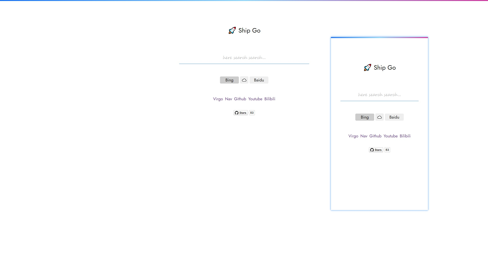

A simple search page, which includes bing and baidu. 🤩

You can access it at [Ship Go](https://ovirgo.com/ship)


## Quick Start

It has a light configuration file - `config.js` , which allows you to set default engine and nav items, like this:

```js
const config = {
	// Set default engine, includes
	// - by: bing
	// - go: google - a piece of 404 cloud
	// - bd: baidu
	engine: 'by',	
	// Set frequents nav
	nav: {
		Virgo: '//ovirgo.com',
		Nav: '//ovirgo.com/nav',
		Github: '//github.com/loveminimal',
		Youtube: '//youtube.com',
		Bilibili: '//bilibili.com'
	}
}
```

And you can toggle light/dark mode by click the rocket icon.

## Screenshots

Here is a screenshot:



Just for fun. 🚀

## Changelogs

- 2022-07-15 17:45 [Added] Add dark mode.